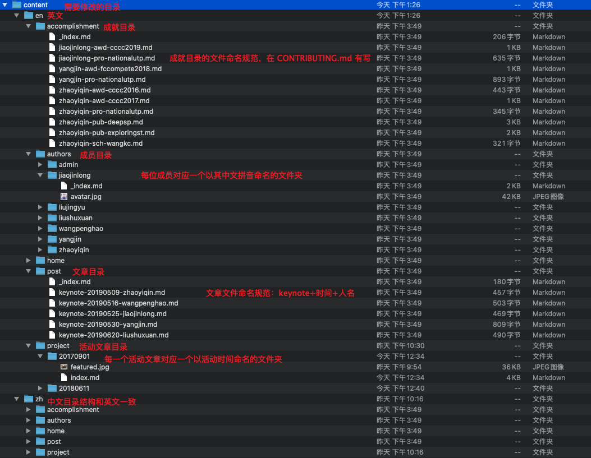

#  Pic_Storage
### 此仓库专为 iOS Club [官网](https://github.com/TJNU-iOS-Club/BlogSrc-Of-TJNU-iOS-Club) 的文章中所使用的外链图片备份所用！！
### 为什么要图片备份？
鉴于经费考虑（其实就是社团没钱），社团官网完全使用网络的免费资源搭建！其中 markdown 图床也是推荐大家使用网络上的免费图床，但是这些网络图床，不在社团的可控范围中，一旦使用的网络图床挂了，官网文章中的图片
就全没有了！！为了应对这种隐患，故建议大家使用免费的外链图床写完文章后，将文中所有使用外链的图片备份至本仓库。
### 要求只有一点：
 此仓库的文件结构 和 iOS Club [官网](https://github.com/TJNU-iOS-Club/BlogSrc-Of-TJNU-iOS-Club) 源码仓库的文件结构**必须保持一致**，连**文件名也要保持一致**！！

这样做的目的也是为了当外链图床挂了以后，启用本仓库备份的图片时，方便寻找，以恢复图片！！！

